# Database Schema Documentation

This document describes the normalized MySQL schema for Toyota service center operations tracking. It is derived from the CSV files in this folder and is intended as the canonical schema and data-loading blueprint.

## Overview

Purpose: Track repair orders (ROs), jobs performed by technicians, and daily repeat-repair metrics. The schema avoids duplication and uses `ro_no` as the central linking identifier.

Tables:
- `repair_orders` — master table for repair-order (RO) level data (from Daily CPUs Report)
- `technicians` — unique list of technicians
- `jobs` — job-level records linked to `repair_orders` and `technicians` (from Technician Report)
- `repeat_repairs` — aggregated daily metrics for repeat repairs

Database connection (example):
- Engine: MySQL
- Host: localhost
- Port: 3306
- User: root
- Password: root
- Database name: toyota_service

> Note: Do not hard-code credentials in production. Use environment variables or a secrets manager.

---

## Table: `repair_orders`

Master table containing RO-level information sourced primarily from `database/20251112_141532_daily_DAILY CPUS REPORT.csv`.

Columns:
- `ro_no` VARCHAR(50) PRIMARY KEY — Repair Order Number (unique)
- `service_date` DATE — Date of service (from SERVICE DATE column)
- `chassis_number` VARCHAR(100)
- `service_nature` VARCHAR(50)
- `campaign_type` VARCHAR(50)
- `customer_source` VARCHAR(50)
- `customer_name` VARCHAR(255)
- `customer_cnic` VARCHAR(20)
- `customer_ntn` VARCHAR(50)
- `customer_dob` DATE
- `customer_mobile_no` VARCHAR(20)
- `customer_landline_number` VARCHAR(20)
- `customer_mobile_no2` VARCHAR(20)
- `customer_email` VARCHAR(255)
- `customer_type` VARCHAR(50)
- `house_no` VARCHAR(255)
- `street_no` VARCHAR(255)
- `city_of_residence` VARCHAR(100)
- `postal_code` VARCHAR(20)
- `insurance_status` VARCHAR(10)
- `insurance_company` VARCHAR(255)
- `insurance_expiry_date` DATE
- `labour_sales` DECIMAL(10,2)
- `parts_sales` DECIMAL(10,2)
- `sublet_sales` DECIMAL(10,2)
- `odometer_reading` INT
- `vehicle_type` VARCHAR(50)
- `model_year` INT
- `reg_no` VARCHAR(50)
- `service_sub_category` VARCHAR(100)
- `vehicle_make` VARCHAR(50)
- `receiving_date_time` DATETIME
- `delivery_date_time` DATETIME
- `promised_date_time` DATETIME
- `prefered_date_time_for_psfu` DATETIME
- `voc` TEXT
- `sa_ta_instructions` TEXT
- `job_performed_by_technicians` TEXT
- `controller_remarks` TEXT
- `service_advisor_name` VARCHAR(100)
- `technical_advisor_name` VARCHAR(100)
- `job_controller_name` VARCHAR(100)
- `vehicle_variant` VARCHAR(100)
- `imc_vehic` VARCHAR(10)
- `source_page` INT
- `table_number` INT
- `created_at` TIMESTAMP DEFAULT CURRENT_TIMESTAMP

Indexes:
- PRIMARY KEY (`ro_no`)
- INDEX (`service_date`)
- INDEX (`reg_no`)
- INDEX (`customer_name`)

Notes:
- One row per repair order.
- Monetary columns use DECIMAL(10,2).
- Timestamps preserve full datetime information.

---

## Table: `technicians`

Stores unique technician identities referenced by jobs.

Columns:
- `technician_id` INT PRIMARY KEY AUTO_INCREMENT
- `technician_name` VARCHAR(100) UNIQUE NOT NULL
- `created_at` TIMESTAMP DEFAULT CURRENT_TIMESTAMP
- `updated_at` TIMESTAMP DEFAULT CURRENT_TIMESTAMP ON UPDATE CURRENT_TIMESTAMP

Indexes:
- PRIMARY KEY (`technician_id`)
- UNIQUE INDEX (`technician_name`)

Notes:
- Technician names are deduplicated from both CSVs. If a more robust identity is required, extend this table (email, phone, employee_id).

---

## Table: `jobs`

Job-level table representing individual tasks performed by technicians, primarily from `database/20251112_141532_technician_TECHNICIAN REPORT1.csv`.

Columns:
- `job_id` INT PRIMARY KEY AUTO_INCREMENT
- `sr_no` INT NULL
- `ro_no` VARCHAR(50) NOT NULL — FOREIGN KEY REFERENCES `repair_orders`(`ro_no`) ON DELETE CASCADE
- `technician_id` INT NULL — FOREIGN KEY REFERENCES `technicians`(`technician_id`) ON DELETE SET NULL
- `mileage` INT NULL
- `msi` VARCHAR(50) NULL
- `no_of_jobs` INT NULL
- `reg_no` VARCHAR(50) NULL
- `variant` VARCHAR(100) NULL
- `customer_name` VARCHAR(255) NULL
- `service_adviser` VARCHAR(100) NULL
- `bay` VARCHAR(50) NULL
- `operations` TEXT NULL
- `creation_time` TIME NULL
- `p_start_time` TIME NULL
- `p_end_time` TIME NULL
- `p_lead_time` TIME NULL
- `gatepass_time` TIME NULL
- `overall_lead_time` TIME NULL
- `remarks` TEXT NULL
- `created_at` TIMESTAMP DEFAULT CURRENT_TIMESTAMP

Indexes:
- PRIMARY KEY (`job_id`)
- INDEX (`ro_no`)
- INDEX (`technician_id`)
- INDEX (`bay`)

Notes:
- Time fields store time only (HH:MM:SS). If job-level date is required later, join with `repair_orders.service_date`.
- `technician_id` may be NULL if the technician name cannot be matched.

---

## Table: `repeat_repairs`

Daily aggregated metrics for repeat repairs.

Columns:
- `id` INT PRIMARY KEY AUTO_INCREMENT
- `date` DATE UNIQUE NOT NULL
- `total_vehicle_delivered` INT NOT NULL
- `repeat_repair_count` INT NOT NULL
- `repeat_repair_percentage` DECIMAL(5,2) NOT NULL
- `created_at` TIMESTAMP DEFAULT CURRENT_TIMESTAMP
- `updated_at` TIMESTAMP DEFAULT CURRENT_TIMESTAMP ON UPDATE CURRENT_TIMESTAMP

Indexes:
- PRIMARY KEY (`id`)
- UNIQUE INDEX (`date`)

Notes:
- `repeat_repair_percentage` stored with 2 decimal places.
- This table is derived from analysis over `repair_orders` and `jobs`.

---

## Entity Relationship Diagram

```mermaid
erDiagram
    repair_orders ||--o{ jobs : "has many"
    technicians ||--o{ jobs : "performs"
    
    repair_orders {
        varchar ro_no PK
        date service_date
        varchar chassis_number
        varchar customer_name
        varchar reg_no
        datetime receiving_date_time
        datetime delivery_date_time
    }
    
    technicians {
        int technician_id PK
        varchar technician_name UK
        timestamp created_at
    }
    
    jobs {
        int job_id PK
        varchar ro_no FK
        int technician_id FK
        varchar bay
        text operations
        time p_start_time
        time p_end_time
    }
    
    repeat_repairs {
        int id PK
        date date UK
        int total_vehicle_delivered
        int repeat_repair_count
        decimal repeat_repair_percentage
    }
```



---

## Normalization Strategy

- 1NF: All fields are atomic (no repeating groups). Tables represent single entity types.
- 2NF: Non-key attributes in `jobs` and `repair_orders` depend on their table's primary key.
- 3NF: No transitive dependencies in the designed schema — e.g., technician details are moved to `technicians`.

This structure avoids duplication (e.g., technician names stored once) and uses `ro_no` as the central identifier.

---

## Design Decisions

- `ro_no` as VARCHAR(50): supports alphanumeric ROs and variable lengths.
- Separate `technicians` table: avoids repeated names across jobs and enables extension.
- TIME datatype for job-level times: job times are stored as time-of-day; join with `service_date` if date context is required.
- DECIMAL(10,2) for monetary values ensures precision.
- ON DELETE CASCADE for `jobs.ro_no` to keep referential integrity when ROs removed.
- ON DELETE SET NULL for `jobs.technician_id` to retain job history if a technician record is removed.

---

## Data Loading Strategy

Steps to load CSV data into the normalized schema:

1. Create the database and tables (MySQL). Use migration tooling or SQL scripts.

2. Load `repair_orders`:
   - Parse `database/20251112_141532_daily_DAILY CPUS REPORT.csv`.
   - Map CSV columns to `repair_orders` fields. Convert timestamps to DATETIME and monetary fields to DECIMAL.
   - Insert rows; skip or log rows with missing `ro_no`.

3. Load `technicians`:
   - Collect unique technician names from both CSVs (Daily CPUs Report and Technician Report).
   - Normalize and trim names; insert unique names into `technicians` and capture `technician_id` mapping.

4. Load `jobs`:
   - Parse `database/20251112_141532_technician_TECHNICIAN REPORT1.csv`.
   - For each CSV row, lookup `repair_orders.ro_no` (or create a repair_orders placeholder if missing and business rules allow).
   - Lookup `technician_id` by name (use NULL when not found).
   - Convert time strings to TIME; insert job records referencing `technician_id` and `ro_no`.

5. Populate `repeat_repairs`:
   - Aggregate daily counts from `repair_orders` and `jobs` (determine repeat repairs by analyzing historical repair_orders per reg_no or customer as per business logic).
   - Insert aggregated metrics per date.

# Database Schema Documentation (Denormalized)

This document describes the denormalized MySQL schema used to store Toyota service center CSV exports. It mirrors CSV file structures directly and avoids cross-table relationships: each table represents one source CSV and is loaded as-is.

## Overview

Purpose: Store daily CSV exports for operational reporting and analytics. The schema intentionally uses denormalized tables to simplify ingestion and allow straightforward CSV-to-table mapping.

Tables:
- `technician_reports` — denormalized table reflecting the Technician Report CSV
- `daily_cpus_reports` — denormalized table reflecting the Daily CPUs Report CSV
- `repeat_repairs` — daily repeat-repair metrics (one row per date)

Database connection (example):
- Engine: MySQL
- Host: localhost
- Port: 3306
- User: root
- Password: root
- Database name: toyota_service

> Note: For production, store credentials securely (env vars, secrets manager). See `.env.example` for an example.

---

## Table: `technician_reports`

Stores technician job records exactly as provided in the Technician Report CSV (`database/20251112_141532_technician_TECHNICIAN REPORT1.csv`). Each row corresponds to one line in the CSV.

Columns:

- `id` INT PRIMARY KEY AUTO_INCREMENT — Unique identifier for this record
- `sr` VARCHAR(64) — Serial number from CSV ("Sr.")
- `ro_no` VARCHAR(64) — Repair Order Number
- `mileage` INT — Vehicle mileage
- `msi` VARCHAR(128) — MSI category
- `no_of_jobs` INT — Number of jobs
- `reg_no` VARCHAR(64) — Vehicle registration number
- `variant` VARCHAR(255) — Vehicle variant
- `customer_name` VARCHAR(255) — Customer name
- `service_adviser` VARCHAR(128) — Service adviser name
- `technician_name` VARCHAR(255) — Technician who performed the job
- `bay` VARCHAR(64) — Bay location
- `operations` TEXT — Operations performed
- `creation_time` TIME — Job creation time
- `p_start_time` TIME — Process start time
- `p_end_time` TIME — Process end time
- `p_lead_time` TIME — Process lead time
- `gatepass_time` TIME — Gatepass time
- `overall_lead_time` TIME — Overall lead time
- `remarks` TEXT — Additional remarks
- `created_at` TIMESTAMP — Record insertion timestamp (default NOW)

Indexes:
- PRIMARY KEY (`id`)
- INDEX (`ro_no`)

Notes:
- The table stores data as-is from CSV. There are no foreign keys or normalization constraints. Duplicate `ro_no` or `technician_name` values are expected and acceptable.

---

## Table: `daily_cpus_reports`

Stores daily CPU/service records exactly as provided in the Daily CPUs Report CSV (`database/20251112_141532_daily_DAILY CPUS REPORT.csv`). Each row corresponds to one service record in the CSV.

Highlighted columns (full list in DDL):

- `id` INT PRIMARY KEY AUTO_INCREMENT
- `service_date` DATE — SERVICE DATE
- `chassis_number` VARCHAR(128)
- `ro_no` VARCHAR(64)
- `service_nature` VARCHAR(128)
- `campaign_type` VARCHAR(64)
- `customer_source` VARCHAR(128)
- `customer_name` VARCHAR(255)
- `customer_cnic` VARCHAR(64)
- `customer_ntn` VARCHAR(64)
- `customer_dob` DATE
- `customer_mobile_no` VARCHAR(64)
- `customer_landline_number` VARCHAR(64)
- `customer_mobile_no2` VARCHAR(64)
- `customer_email` VARCHAR(255)
- `customer_type` VARCHAR(64)
- `house_no` VARCHAR(255)
- `street_no` VARCHAR(255)
- `city_of_residence` VARCHAR(128)
- `postal_code` VARCHAR(32)
- `insurance_status` VARCHAR(64)
- `insurance_company` VARCHAR(255)
- `insurance_expiry_date` DATE
- `labour_sales` DECIMAL(15,2)
- `parts_sales` DECIMAL(15,2)
- `sublet_sales` DECIMAL(15,2)
- `odometer_reading` INT
- `vehicle_type` VARCHAR(64)
- `model_year` INT
- `reg_no` VARCHAR(64)
- `service_sub_category` VARCHAR(128)
- `vehicle_make` VARCHAR(128)
- `receiving_date_time` DATETIME
- `delivery_date_time` DATETIME
- `promised_date_time` DATETIME
- `prefered_date_time_for_psfu` DATETIME
- `voc` TEXT
- `sa_ta_instructions` TEXT
- `job_performed_by_technicians` TEXT
- `controller_remarks` TEXT
- `service_advisor_name` VARCHAR(128)
- `technical_advisor_name` VARCHAR(128)
- `job_controller_name` VARCHAR(128)
- `technician_name` VARCHAR(255)
- `vehicle_variant` VARCHAR(255)
- `imc_vehic` VARCHAR(32)
- `source_page` VARCHAR(32)
- `table_number` VARCHAR(32)
- `created_at` TIMESTAMP — Record insertion timestamp

Indexes:
- PRIMARY KEY (`id`)
- INDEX (`service_date`)
- INDEX (`ro_no`)
- INDEX (`reg_no`)

Notes:
- Data is stored exactly as present in the CSV; no normalization performed.

---

## Table: `repeat_repairs`

Stores daily aggregated repeat repair metrics as provided in `database/Repeat Repair_extracted.csv`.

Columns:

- `date` DATE PRIMARY KEY — Date of metric
- `total_vehicle_delivered` INT — Total vehicles delivered that day
- `repeat_repair_count` INT — Number of repeat repair occurrences
- `repeat_repair_percentage` DECIMAL(6,2) — Repeat repair percentage
- `created_at` TIMESTAMP — Record insertion timestamp

```markdown
# Database Schema Documentation (updated)

This file documents the current, denormalized schema used by the Toyota CSV ingestion pipeline. The design intentionally mirrors CSV exports to keep ingestion simple and robust. The pipeline provides a typed `repeat_repairs` table for analytics; CSV-preserving verbatim tables were removed to avoid duplicate storage and simplify the schema.

Schema highlights
- Denormalized tables: `technician_reports`, `daily_cpus_reports` — direct mappings of the two CSV sources.
- Repeat-repair storage:
    - `repeat_repairs` — typed/parsed metrics (DATE, INT, DECIMAL) used for reporting and analytics and treated as the authoritative source for repeat-repair metrics.
    - Note: CSV-preserving verbatim tables (previously used for lineage) were intentionally removed to simplify storage; ingestion now upserts parsed/typed rows directly into `repeat_repairs`.
- `ingestion_log` — small tracking table to record (filename, mtime, table_name, rows_inserted) and help avoid re-ingestion by file timestamp.

Full DDL is provided in `schema.sql` (idempotent CREATE TABLE statements). Below are the important tables and their purpose.

Table: `technician_reports`
- Denormalized table that stores each row from the Technician Report CSV as-is.
- Primary key: `id` (INT AUTO_INCREMENT).
- Use-case: debugging, row-level inspection, and ad-hoc queries over raw technician data.

Table: `daily_cpus_reports`
- Denormalized table that stores each row from the Daily CPUs Report CSV as-is.
- Primary key: `id` (INT AUTO_INCREMENT). Indexed by `service_date`, `ro_no`, `reg_no`.

Table: `repeat_repairs`

- `repeat_repairs` (typed): primary and authoritative storage for repeat-repair metrics.
    - Columns: `date` (DATE primary key), `total_vehicle_delivered` (INT), `repeat_repair_count` (INT), `repeat_repair_percentage` (DECIMAL), `created_at` TIMESTAMP.
    - This table is typically populated from `database/Repeat Repair_extracted.csv` during ingestion; rows with unparseable dates are skipped.
    - The pipeline now parses and upserts typed rows directly into `repeat_repairs`. CSV-preserving verbatim tables were intentionally removed to avoid duplicate storage of the same metrics.

Table: `ingestion_log`
- Tracks ingested files by filename+mtime+table_name to avoid accidental re-insertions of the same file.
- Recommended to rely on this for idempotency or add unique constraints on `repeat_repairs` (it already enforces uniqueness on `date`) if you want stricter guarantees.

How ingestion works (summary)
1. `populate_db.py` ensures the database and schema exist (can create database if allowed).
2. CSVs are read with pandas; headers are matched case-insensitively for normalized inserts.
3. `daily_cpus_reports` and `technician_reports` are bulk-inserted (typed coercion applied where relevant).
4. Repeat-repair CSV is parsed and upserted into the typed `repeat_repairs` table (only rows with a valid parsed date are inserted/updated); verbatim CSV-preserving tables are no longer created.
5. Ingestion writes an `ingestion_log` entry for each table it populates (filename + mtime) so subsequent runs can skip already-ingested files.

Commands
```powershell
# create schema
mysql -u root -p toyota_service < database/schema.sql

# run population (reads CSVs in database/)
python -m database.populate_db --verbose

# dry-run to validate parsing only
python -m database.populate_db --dry-run --verbose
```

Notes and recommendations
- Keep `schema.sql` and `schema.md` in sync: any DDL change should be documented here.
- For stricter idempotency, rely on `ingestion_log` or add a UNIQUE constraint on `(date)` in `repeat_repairs` (the table already enforces uniqueness on `date`) if you want stricter guarantees.
- If you need normalized relational models later, you can build ETL jobs that read the denormalized tables and populate normalized tables in a separate migration step.

See `schema.sql` for the exact CREATE TABLE statements used by the ingestion scripts.

Document last updated: 2025-11-14

```
python -m database.populate_db --dry-run --verbose

```


